# Relatório Técnico - Projeto Final

**Curso:** Engenharia de Software  
**Disciplina:** Programação para Sistemas Paralelos e Distribuídos  
**Data:** 6 de Dezembro de 2025  
**Instituição:** Universidade de Brasília - UnB

## Equipe

| Nome Completo                     | Matrícula   |
|-----------------------------------|-------------|
| FLÁVIO GUSTAVO ARAÚJO DE MELO     | 211030602   |
| GUILHERME SILVA DUTRA             | 221021984   |
| GUSTAVO FRANCA BOA SORTE          | 211030774   |
| HARRYSON CAMPOS MARTINS           | 211039466   |

---

## 1. Introdução

### 1.1 Objetivo

Este projeto tem como objetivo principal desenvolver e analisar o desempenho de uma aplicação distribuída baseada em microserviços implantada em um cluster Kubernetes. O trabalho foca no monitoramento de aplicações containerizadas, implementando observabilidade através de ferramentas modernas como Prometheus para coleta de métricas e Locust para testes de carga.

### 1.2 Visão Geral

O projeto consiste em uma aplicação de catálogo de peças automotivas, desenvolvida com arquitetura de microserviços que se comunica via gRPC. A aplicação foi containerizada utilizando Docker e orquestrada em um cluster Kubernetes local (Kind - Kubernetes in Docker), permitindo a simulação de um ambiente distribuído realista.

A aplicação é composta por três módulos principais:
- **Módulo P (P-API)**: API Gateway desenvolvida em FastAPI que expõe endpoints REST para o frontend
- **Módulo A (Server-A)**: Microserviço de catálogo responsável por consultar peças no banco de dados
- **Módulo B (Server-B)**: Microserviço de pricing responsável por calcular orçamentos e processar compras

A infraestrutura inclui ainda um banco de dados PostgreSQL para persistência de dados, um sistema de monitoramento com Prometheus para coleta de métricas em tempo real, e Locust para simulação de carga e testes de desempenho.

### 1.3 Justificativa

Com o crescimento de aplicações distribuídas em ambientes de produção, torna-se essencial dominar ferramentas e práticas de orquestração de containers, monitoramento de sistemas e análise de desempenho. Este projeto proporciona experiência prática com tecnologias amplamente utilizadas no mercado, como Kubernetes, gRPC, Prometheus e ferramentas de containerização.

---

## 2. Metodologia de Trabalho

### 2.1 Organização da Equipe

A equipe se reuniu semanalmente durante o desenvolvimento do projeto, com encontros presenciais e remotos para planejamento, desenvolvimento colaborativo e resolução de problemas. O trabalho foi dividido em três fases principais, com responsabilidades compartilhadas entre todos os membros.

### 2.2 Cronograma de Desenvolvimento

#### Encontro 1: Montagem do Kubernetes
- **Duração**: 2 dias
- **Atividades realizadas**:
  - Estudo da arquitetura Kubernetes e conceitos de pods, deployments e services
  - Instalação e configuração do Kind (Kubernetes in Docker)
  - Criação do cluster multi-nó com 1 control-plane e 3 worker nodes
  - Desenvolvimento dos manifestos YAML para deployments e services
  - Configuração de networking entre os microserviços
  - Implementação de health checks e readiness probes
  - Setup do registry local para imagens Docker

#### Encontro 2: Configuração do Locust e Prometheus
- **Duração**: 1 dia
- **Atividades realizadas**:
  - Integração do Prometheus com os microserviços
  - Implementação de métricas customizadas (counters, histograms, gauges)
  - Exposição de endpoints `/metrics` em cada serviço
  - Configuração do arquivo `prometheus.yml` para scraping
  - Desenvolvimento do `locustfile.py` com cenários de teste
  - Criação de tarefas simulando requisições de usuários reais
  - Implementação de pesos nas tarefas para simular padrões de uso
  - Testes iniciais de conectividade e coleta de métricas

#### Encontro 3: Execução dos Testes
- **Duração**: 1 dia
- **Atividades realizadas**:
  - Definição dos cenários de teste (base, moderado, alta distribuição)
  - Execução de testes de carga com diferentes configurações
  - Coleta e análise de métricas de desempenho
  - Variação de parâmetros (réplicas, workers, carga)
  - Documentação dos resultados obtidos
  - Análise comparativa entre cenários

### 2.3 Ferramentas Utilizadas

- **Controle de versão**: Git e GitHub para versionamento de código
- **Comunicação**: Discord e WhatsApp para coordenação da equipe
- **Desenvolvimento**: VS Code como IDE principal
- **Documentação**: Markdown para documentação técnica
- **Testes**: Locust para testes de carga e Prometheus para monitoramento

---

## 3. Montagem do Kubernetes

### 3.1 Escolha da Ferramenta: Kind (Kubernetes in Docker)

Para este projeto, optamos por utilizar o **Kind (Kubernetes in Docker)** como plataforma de orquestração. Kind é uma ferramenta que permite executar clusters Kubernetes locais utilizando containers Docker como nós, sendo ideal para desenvolvimento e testes.

**Vantagens do Kind:**
- Criação rápida de clusters multi-nó
- Baixo consumo de recursos comparado a VMs
- Ambiente isolado e reproduzível
- Integração nativa com Docker
- Suporte a funcionalidades avançadas do Kubernetes

 #### Migração do Minikube para Kind


**Antes (Minikube)**: Cluster single-node simulado, exposição via LoadBalancer + minikube tunnel, carregamento manual de imagens com minikube image load.

**Agora (Kind)**: Cluster multi-nó real (1 control-plane + 3 workers), exposição via NodePort nativo, registry local para imagens.

### 3.2 Arquitetura do Cluster

O cluster foi configurado com a seguinte topologia:

```yaml
# Configuração: kind-cluster-config.yaml
- 1 nó Control Plane (Master)
  - Gerencia o estado do cluster
  - Executa API Server, Scheduler, Controller Manager
  - Expõe portas 8000, 80, 443 para acesso externo

- 3 nós Workers
  - Worker 1, Worker 2, Worker 3
  - Executam os pods das aplicações
  - Labels: worker-id: "1", "2", "3"

# Redes configuradas:
- Pod Subnet: 10.244.0.0/16
- Service Subnet: 10.96.0.0/12
```

### 3.3 Processo de Instalação

O processo de instalação foi automatizado através do script `setup-kind-cluster.sh`:

```bash
# 1. Verificação de dependências
- Kind instalado
- kubectl instalado
- Docker em execução

# 2. Criação do registry local
- Registry Docker na porta 5001
- Permite push/pull de imagens localmente

# 3. Criação do cluster
kind create cluster --config=kind-cluster-config.yaml

# 4. Configuração de networking
- Conexão do registry ao cluster
- Configuração de DNS interno

# 5. Build e push das imagens
docker-compose build
docker tag car_build-server-a:latest localhost:5001/car_build-server-a:latest
docker push localhost:5001/car_build-server-a:latest
# (repetir para server-b e p-api)

# 6. Deploy dos manifestos
kubectl apply -f manifests/
```

### 3.4 Componentes Kubernetes Implementados

#### 3.4.1 Camada de Dados - PostgreSQL

**PersistentVolumeClaim (postgres-pvc.yaml)**
```yaml
kind: PersistentVolumeClaim
spec:
  resources:
    requests:
      storage: 1Gi
```
- Provisiona armazenamento persistente de 1GB
- Garante que dados sobrevivam a reinicializações

**ConfigMap (postgres-configmap.yaml)**
- Armazena script SQL de inicialização
- Cria tabelas `carros` e `pecas`
- Popula dados iniciais (Fusca, Civic, Corolla)

**Deployment (postgres-deployment.yaml)**
```yaml
image: postgres:15-alpine
ports:
  - containerPort: 5432
env:
  - POSTGRES_DB: car_build_db
  - POSTGRES_USER: car_build_user
  - POSTGRES_PASSWORD: car_build_password
```

**Service (postgres-service.yaml)**
```yaml
type: ClusterIP
```
- Cria DNS interno `postgres-service`
- Acessível apenas dentro do cluster

#### 3.4.2 Camada de Microserviços

**Server-A - Catálogo (server-a-deployment.yaml)**
```yaml
image: localhost:5001/car_build-server-a:latest
ports:
  - containerPort: 50051  # gRPC
  - containerPort: 9091   # Métricas
replicas: 1  # Configurável para testes
```
- Microserviço Node.js com gRPC
- Conecta ao PostgreSQL via DNS interno
- Expõe métricas para Prometheus

**Server-B - Pricing (server-b-deployment.yaml)**
```yaml
image: localhost:5001/car_build-server-b:latest
ports:
  - containerPort: 50052  # gRPC
  - containerPort: 9092   # Métricas
replicas: 1
```
- Calcula orçamentos e processa compras
- Implementa regras de negócio (frete, descontos)

#### 3.4.3 Camada de API Gateway

**P-API (p-api-deployment.yaml)**
```yaml
image: localhost:5001/car_build-p-api:latest
ports:
  - containerPort: 8000
env:
  - SERVER_A_HOST: server-a-service
  - SERVER_B_HOST: server-b-service
replicas: 1
```
- API Gateway FastAPI
- Converte HTTP REST para gRPC
- Configuração de CORS para frontend

**Service (p-api-service.yaml)**
```yaml
type: NodePort
ports:
  - port: 8000
    nodePort: 30080
```
- Único serviço exposto externamente
- Antes estávamos usando o loadbalancer (por conta da facilidade de subir com o minikube tunnel), mas, o NodePort foi escolhido nessa versão pra facilitar a configuração do kind.
- Acessível via localhost:8000

### 3.5 Fluxo de Comunicação

```
[Cliente/Frontend]
       ↓ HTTP REST
[localhost:8000]
       ↓
[NodePort Service]
       ↓
[P-API Pod] ← Converte REST → gRPC
       ↓
[ClusterIP Services]
    ↙          ↘
[Server-A]  [Server-B]
    ↓
[PostgreSQL]
```

## 4. Monitoramento e Observabilidade

### 4.1 Prometheus: Sistema de Monitoramento

#### 4.1.1 Conceito e Arquitetura

O Prometheus é um sistema de monitoramento e alerta open-source desenvolvido pela SoundCloud e atualmente mantido pela CNCF (Cloud Native Computing Foundation). Ele coleta métricas de sistemas distribuídos através de requisições HTTP periódicas (scraping) aos endpoints `/metrics` dos serviços monitorados.

**Características principais:**
- **Modelo de Pull**: Prometheus busca ativamente as métricas (scraping)
- **Time Series Database**: Armazena dados com timestamp
- **PromQL**: Linguagem de queries poderosa para análise
- **Service Discovery**: Descobre automaticamente targets
- **Alerting**: Sistema de alertas integrado

#### 4.1.2 Configuração do Prometheus

O arquivo `prometheus.yml` define os alvos de monitoramento:

```yaml
global:
  scrape_interval: 15s      # Coleta a cada 15 segundos
  evaluation_interval: 15s   # Avalia regras a cada 15 segundos

scrape_configs:
  # P-API Gateway
  - job_name: 'p-api'
    static_configs:
      - targets: ['localhost:8000']
    metrics_path: '/metrics'

  # Microserviço Server-A
  - job_name: 'server-a'
    static_configs:
      - targets: ['localhost:9091']

  # Microserviço Server-B
  - job_name: 'server-b'
    static_configs:
      - targets: ['localhost:9092']
```

#### 4.1.4 Queries PromQL Essenciais

```promql
# Taxa de requisições por segundo
rate(p_api_requests_total[1m])

# Latência P95 (95% das requisições)
histogram_quantile(0.95, 
  rate(p_api_request_duration_seconds_bucket[5m])
) * 1000

# Taxa de erro (%)
(sum(rate(p_api_requests_total{status=~"5.."}[1m])) / 
 sum(rate(p_api_requests_total[1m]))) * 100

# Requisições ativas
p_api_active_requests

# Throughput total do sistema
sum(rate(server_a_grpc_requests_total[1m])) + 
sum(rate(server_b_grpc_requests_total[1m]))

# Latência média de queries no banco
rate(server_a_db_query_duration_seconds_sum[5m]) / 
rate(server_a_db_query_duration_seconds_count[5m])
```

### 4.2 Locust: Testes de Carga

#### 4.2.1 Conceito e Funcionalidades

Locust é uma ferramenta de teste de carga open-source escrita em Python que permite simular milhões de usuários simultâneos. Diferente de ferramentas tradicionais, Locust define o comportamento dos usuários através de código Python, oferecendo máxima flexibilidade.

**Características principais:**
- Testes definidos em código Python
- Interface web para controle e visualização
- Distribuição de carga em múltiplas máquinas
- Métricas em tempo real
- Exportação de resultados

#### 4.2.2 Implementação do Locustfile

Arquivo `locustfile.py`:

```python
from locust import HttpUser, task, between
import random

class CarBuildUser(HttpUser):
    """
    Simula usuários interagindo com a API de peças de carros.
    Locust executará esses testes de carga automaticamente.
    """
    
    # Tempo de espera entre requisições (simula comportamento humano)
    wait_time = between(1, 3)  # Entre 1 e 3 segundos
    
    # Host base (pode ser sobrescrito via linha de comando)
    host = "http://localhost:8000"
    contador_usuarios = 0
    
    def on_start(self):
        """Executado uma vez quando o usuário inicia"""
        CarBuildUser.contador_usuarios += 1
        print(f"Usuário iniciado: {self.__class__.__name__, CarBuildUser.contador_usuarios}")
    
    @task(1)  
    def health_check(self):
        """Testa o endpoint de health check"""
        with self.client.get("/health", catch_response=True) as response:
            if response.status_code == 200 and "healthy" in response.text:
                response.success()
            else:
                response.failure(f"Health check falhou: {response.status_code}")
    
    @task(1)
    def get_pecas(self):
        """Testa busca de peças para diferentes modelos de carro"""
        carros = [
            {"modelo": "Civic", "ano": 2023},
            {"modelo": "Corolla", "ano": 2020},
            {"modelo": "Fusca", "ano": 2014},
        ]
        
        carro = random.choice(carros)
        
        with self.client.post(
            "/get-pecas",
            json=carro,
            catch_response=True
        ) as response:
            if response.status_code == 200:
                try:
                    data = response.json()
                    if "pecas" in data:
                        response.success()
                    else:
                        response.failure("Resposta sem campo 'pecas'")
                except Exception as e:
                    response.failure(f"Erro ao parsear JSON: {e}")
            else:
                response.failure(f"Status {response.status_code}")
    
    @task(1)
    def calcular(self):
        """Testa cálculo de orçamento com peças aleatórias"""
        
        # Primeiro busca peças
        carro = {"modelo": "Civic", "ano": 2023}
        pecas_response = self.client.post("/get-pecas", json=carro)
        
        if pecas_response.status_code == 200:
            try:
                pecas_data = pecas_response.json()
                pecas = pecas_data.get("pecas", [])
                
                if pecas:
                    
                    # Seleciona peças aleatórias para orçamento
                    num_pecas = random.randint(1, min(5, len(pecas)))
                    pecas_selecionadas = random.sample(pecas, num_pecas)
                    
                    # Adiciona quantidades
                    itens = [
                        {
                            "peca": peca,
                            "quantidade": 1
                        }
                        for peca in pecas_selecionadas
                    ]
                    
                    payload = {"itens": itens}
                    
                    with self.client.post(
                        "/calcular",
                        json=payload,
                        catch_response=True
                    ) as response:
                        if response.status_code == 200:
                            try:
                                data = response.json()
                                if "total" in data:
                                    response.success()
                                else:
                                    response.failure("Resposta sem campo 'total'")
                            except Exception as e:
                                response.failure(f"Erro ao parsear JSON: {e}")
                        else:
                            response.failure(f"Status {response.status_code}")
            except Exception as e:
                print(f"Erro no fluxo de orçamento: {e}")
    
    @task(1)
    def pagar(self):
        """Testa fluxo completo:  get pecas -> calcular -> pagar"""
        carro = {"modelo": "Corolla", "ano": 2021}
        pecas_response = self.client.post("/get-pecas", json=carro)
        
        if pecas_response.status_code == 200:
            try:
                pecas_data = pecas_response.json()
                pecas = pecas_data.get("pecas", [])
                
                if pecas:
                    # Seleciona 1-3 peças
                    num_pecas = random.randint(1, min(3, len(pecas)))
                    pecas_selecionadas = random.sample(pecas, num_pecas)
                    
                    itens = [
                        {
                            "peca": peca,
                            "quantidade": 1
                        }
                        for peca in pecas_selecionadas
                    ]
                    
                    # print(itens)
                    # Primeiro calcula
                    calc_response = self.client.post("/calcular", json={"itens": itens})
                    
                    if calc_response.status_code == 200:
                        calc_data = calc_response.json()
                        valor_total = calc_data.get("total", 0)
                        
                        # Realiza compra
                        compra_payload = {
                            "itens": itens,
                            "valor_total": valor_total
                        }
                        
                        with self.client.post(
                            "/pagar",
                            json=compra_payload,
                            catch_response=True
                        ) as response:
                            if response.status_code == 200:
                                try:
                                    data = response.json()
                                    if "pedido_id" in data or "status" in data:
                                        response.success()
                                    else:
                                        response.failure("Resposta sem pedido_id")
                                except Exception as e:
                                    response.failure(f"Erro ao parsear JSON: {e}")
                            else:
                                response.failure(f"Status {response.status_code}")
            except Exception as e:
                print(f"Erro no fluxo de compra: {e}")
```

#### 4.2.4 Métricas Coletadas pelo Locust

- **RPS (Requests Per Second)**: Taxa de requisições
- **Response Time**: Tempo de resposta (min, max, média, P50, P95, P99)
- **Failures**: Número e percentual de falhas
- **Users**: Número de usuários simulados
- **Distribution**: Distribuição de tempos de resposta

### 4.3 Integração Prometheus + Locust

O fluxo de monitoramento funciona da seguinte forma:

```
[Locust] → Gera carga
    ↓
[P-API] → Registra métricas
    ↓
[Prometheus] → Coleta métricas a cada 15s
    ↓
[PromQL] → Analisa dados
    ↓
[Gráficos] → Visualização
```

---

## 5. A Aplicação

### 5.1 Visão Geral da Arquitetura

A aplicação **Car Build** é um sistema de catálogo e orçamento de peças automotivas baseado em microserviços. A arquitetura segue o padrão API Gateway com comunicação gRPC entre serviços internos, garantindo alta performance e tipagem forte nas interfaces.

**Arquitetura de três camadas:**
1. **Frontend**: Aplicação React (não coberta neste relatório)
2. **API Gateway (P)**: FastAPI expondo REST para o frontend
3. **Microserviços (A, B)**: Serviços gRPC especializados
4. **Persistência**: PostgreSQL com dados de carros e peças

### 5.2 Tecnologias Utilizadas

| Componente | Tecnologia | Justificativa |
|------------|-----------|---------------|
| **P-API** | Python + FastAPI | Alta produtividade, async nativo, documentação automática |
| **Server-A** | Node.js + gRPC | Performance em I/O, fácil integração com gRPC |
| **Server-B** | Node.js + gRPC | Consistência tecnológica, cálculos rápidos |
| **Comunicação** | gRPC + Protocol Buffers | Performance superior a REST, tipagem forte |
| **Banco de Dados** | PostgreSQL | ACID, relacional, robusto |
| **Containerização** | Docker | Isolamento, portabilidade |
| **Orquestração** | Kubernetes (Kind) | Escalabilidade, auto-healing, load balancing |

### 5.3 Módulo P (API Gateway)

#### 5.3.1 Responsabilidades

- Expor endpoints REST para o frontend
- Converter requisições HTTP em chamadas gRPC
- Gerenciar CORS para permitir acesso do navegador
- Agregar respostas de múltiplos microserviços
- Expor métricas para Prometheus
- Implementar health checks

#### 5.3.2 Endpoints Implementados

```python
# Health Check
GET /health
Resposta: {"status": "healthy", "service": "p-api"}

# Buscar peças de um carro
POST /get-pecas
Body: {"modelo": "Fusca", "ano": 2014}
Resposta: {
  "pecas": [
    {"id": 1, "nome": "Chassi Original", "valor": 5000.0},
    {"id": 2, "nome": "Motor 1.6", "valor": 3500.0}
  ]
}

# Calcular orçamento
POST /calcular
Body: {
  "itens": [
    {"peca": {...}, "quantidade": 1},
    {"peca": {...}, "quantidade": 2}
  ]
}
Resposta: {
  "precoTotal": 12000.0,
  "frete": 45.0,
  "total": 12045.0
}

# Processar compra
POST /pagar
Body: {
  "itens": [...],
  "cliente": {...}
}
Resposta: {"success": true, "pedido_id": 123}

# Métricas Prometheus
GET /metrics
Resposta: Formato Prometheus
```


### 5.4 Módulo A (Microserviço de Catálogo)

#### 5.4.1 Responsabilidades

- Gerenciar conexão com o banco de dados PostgreSQL
- Buscar peças por modelo e ano do carro
- Buscar informações de carros disponíveis
- Expor serviço gRPC na porta 50051
- Expor métricas na porta 9091


### 5.5 Módulo B (Microserviço de Pricing)

#### 5.5.1 Responsabilidades

- Calcular preço total de orçamentos
- Aplicar regras de frete
- Validar regras de negócio (ex: apenas 1 chassi)
- Processar compras
- Expor serviço gRPC na porta 50052
- Expor métricas na porta 9092


#### 5.5.2 Fluxo de uma Requisição Completa

```
1. Cliente Frontend
   POST http://localhost:8000/get-pecas
   Body: {"modelo": "Fusca", "ano": 2014}
   
2. P-API Gateway (FastAPI)
   - Recebe HTTP POST
   - Valida entrada
   - Converte JSON → Protobuf (catalogo_pb2.Carro)
   - Incrementa métricas (REQUEST_COUNT, ACTIVE_REQUESTS)
   
3. Chamada gRPC ao Server-A
   stub_a.GetPecas(carro) via gRPC
   → Enviado para server-a-service:50051
   
4. Server-A (Node.js gRPC)
   - Recebe mensagem Protobuf
   - Extrai modelo="Fusca", ano=2014
   - Incrementa grpcRequestsTotal
   
5. Query PostgreSQL
   - Conecta via pool de conexões
   - Query: SELECT pecas WHERE modelo='Fusca' AND ano=2014
   - Registra dbQueryDuration
   
6. PostgreSQL
   - Busca dados no disco (PVC persistente)
   - Retorna: Chassi R$5000, Motor R$3500, etc.
   
7. Resposta Server-A → P-API
   - Converte rows para Protobuf (ListaPecas)
   - Envia via gRPC
   - Registra grpcRequestDuration
   
8. P-API processa resposta
   - Converte Protobuf → JSON
   - Registra REQUEST_LATENCY
   - Decrementa ACTIVE_REQUESTS
   
9. Resposta HTTP ao Cliente
   JSON: {"pecas": [{id: 1, nome: "Chassi"...}]}
   
10. Prometheus coleta métricas (15s depois)
    - Scrape /metrics de P-API, Server-A
    - Armazena time series no TSDB
```

### 5.6 Configuração Base da Aplicação

Para atender ao requisito de **configuração base** (mínima paralelização), a aplicação atual está configurada com:

```yaml
# Réplicas: 1 instância de cada serviço
p-api-deployment: replicas: 1
server-a-deployment: replicas: 1
server-b-deployment: replicas: 1
postgres-deployment: replicas: 1

# Resultado:
- Zero paralelização horizontal
- Cada requisição processada sequencialmente
- Distribuição inerente ao gRPC mantida (comunicação entre serviços)
- 1 pod por worker node (no máximo)
```

Esta configuração serve como **baseline** para comparação com cenários mais distribuídos.

Obviamente tudo foi dockerizado 
---


## 6. Cenários de Teste

### 6.1 Cenário 1: Configuração Base (Sem Paralelização)

**Objetivo:** Estabelecer baseline de desempenho

**Configuração:**
- Réplicas: 1 de cada serviço
- Workers: 3 nodes 

**Caso base - 1 usuario e 1 spawn rate**

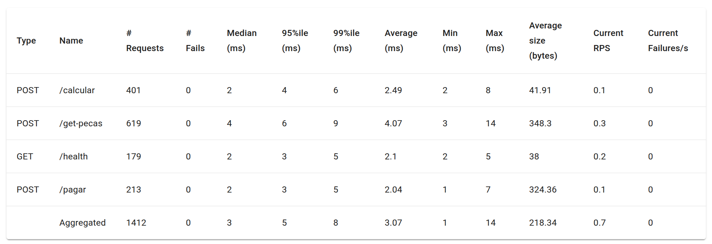

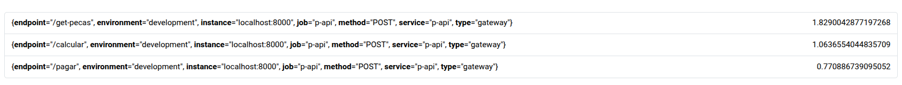

Casos de Teste:

1: 2500 Usuários - 100 Spawn Rate - 3 minutos
2: 5000 Usuários - 100 Spawn Rate - 3 minutos
3: 7500 Usuários - 100 Spawn Rate  - 3 minutos

**Resultados Obtidos: (Locust e Prometheus)**

Query utilizada para monitorar o Prometheus

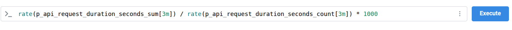


1: 2500 Usuários - 100 Spawn Rate - 3 minutos

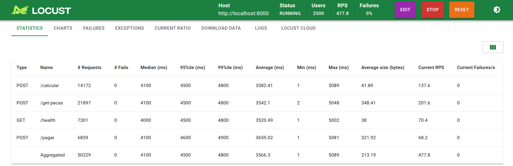

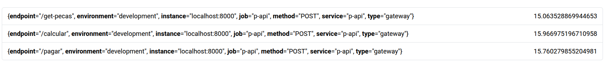

2: 5000 Usuários - 100 Spawn Rate - 3 minutos

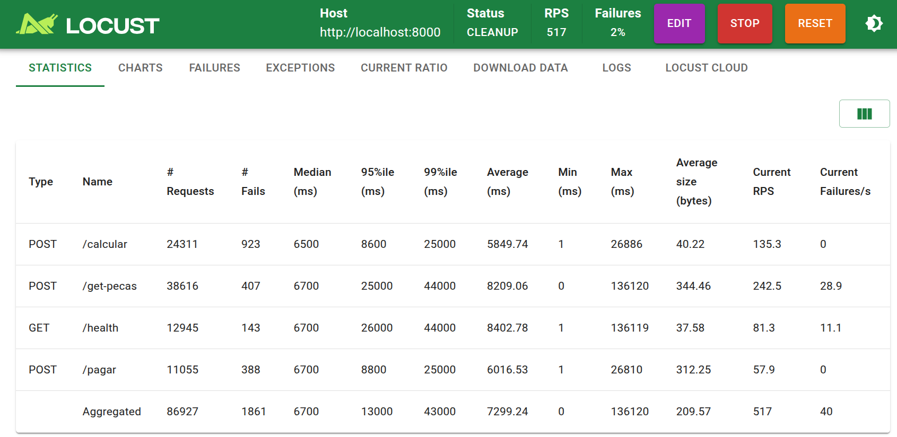

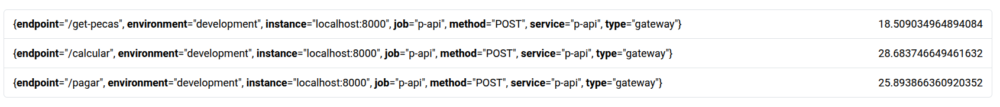

3: 7500 Usuários - 100 Spawn Rate  - 3 minutos

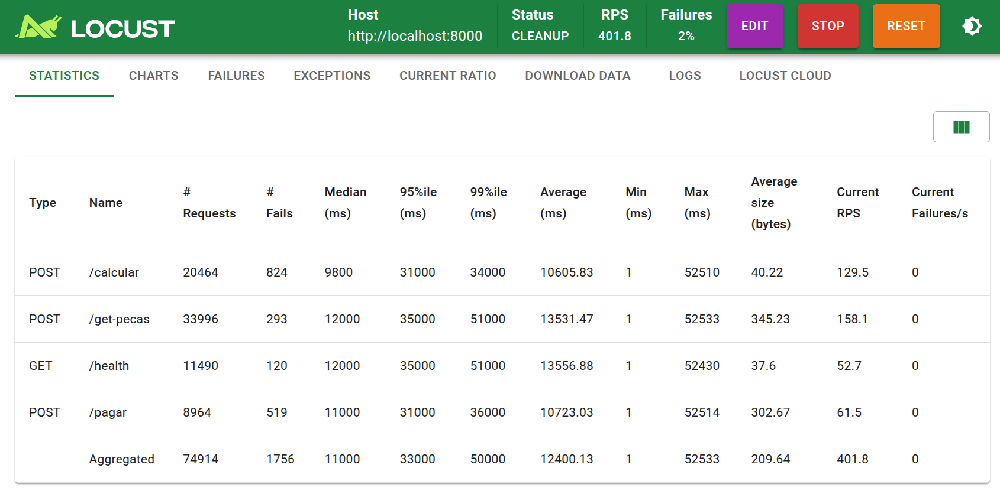

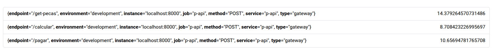

### 6.2 Cenário 2: Alteração do número de réplicas

**Objetivo:** Comparar a partir da aplicação da paralelização

**Configuração:**
- Réplicas: P-API=3, Server-A=3, Server-B=3
- Workers: 3 nodes 

Casos de Teste:

1: 2500 Usuários - 100 Spawn Rate - 3 minutos
2: 5000 Usuários - 100 Spawn Rate - 3 minutos
3: 7500 Usuários - 100 Spawn Rate  - 3 minutos

**Resultados Obtidos: (Locust e Prometheus)**

Query utilizada para monitorar o Prometheus


1: 2500 Usuários - 100 Spawn Rate - 3 minutos

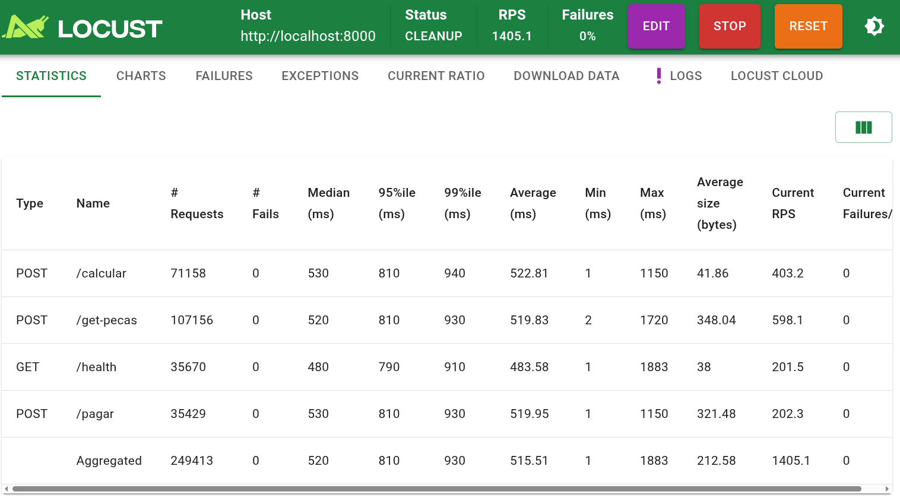

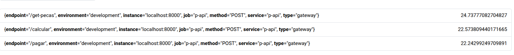

2: 5000 Usuários - 100 Spawn Rate - 3 minutos


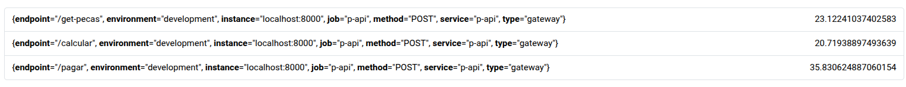

3: 7500 Usuários - 100 Spawn Rate  - 3 minutos

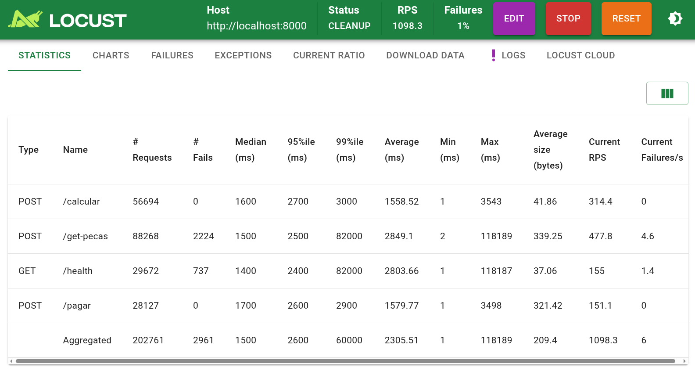

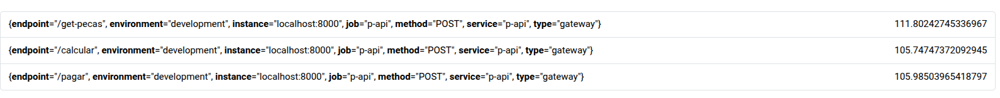


### 6.3 Cenário 3: Numero de Containers Por Workers

**Configuração:**
- Cluster: 3 worker nodes
- Réplicas: P-API=3, Server-A=3, Server-B=3
- Pods por workes: Worker1: 6 , Worker1: 5 , Worker1: 5 

Casos de Teste:

1: 2500 Usuários - 100 Spawn Rate - 3 minutos
2: 5000 Usuários - 100 Spawn Rate - 3 minutos
3: 7500 Usuários - 100 Spawn Rate  - 3 minutos

**Exemplo de mudança para os containers**

```yaml
# Exemplo: Car_Build/manifests/server-a-deployment.yaml
spec:
  replicas: 3
  template:
    spec:
      affinity:
        podAntiAffinity:
          preferredDuringSchedulingIgnoredDuringExecution:
          - weight: 100
            podAffinityTerm:
              labelSelector:
                matchExpressions:
                - key: app
                  operator: In
                  values:
                  - server-a  
              topologyKey: kubernetes.io/hostname
```


**Resultados Obtidos: (Locust e Prometheus)**


Query utilizada para monitorar o Prometheus


1: 2500 Usuários - 100 Spawn Rate - 3 minutos

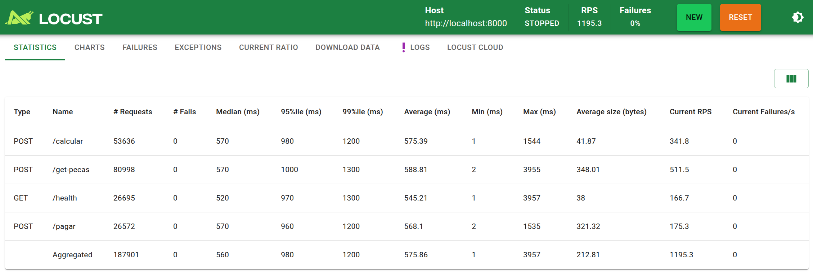

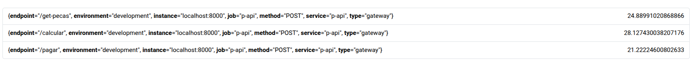

2: 5000 Usuários - 100 Spawn Rate - 3 minutos

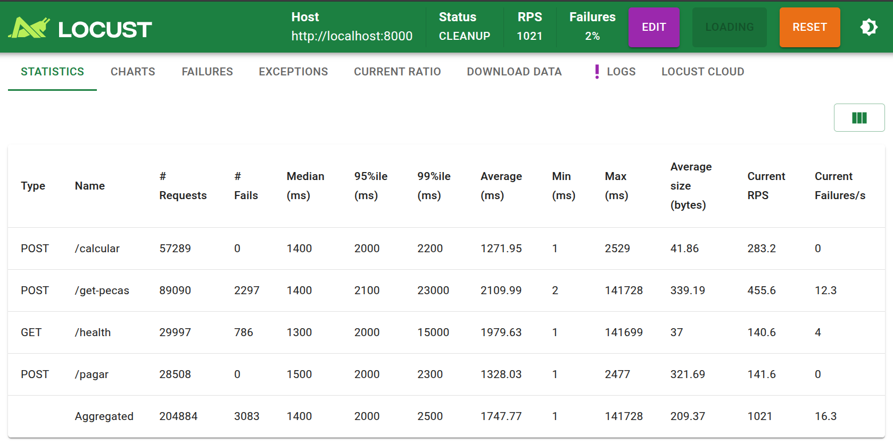


3: 7500 Usuários - 100 Spawn Rate  - 3 minutos

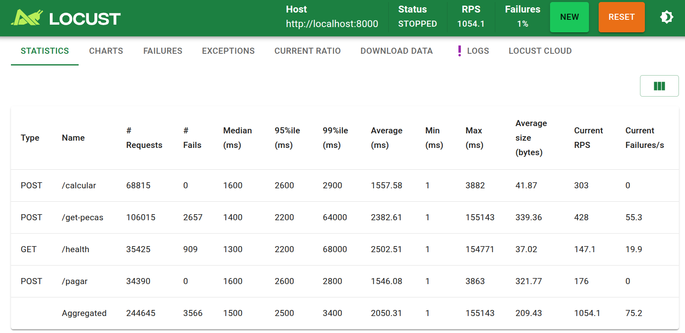

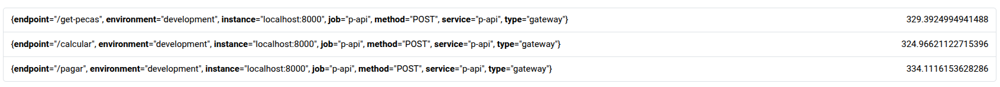


# 6.4 Análise Comparativa

## Análise Comparativa dos Testes de Carga

Os testes foram realizados com três níveis progressivos de carga: **2500**, **5000** e **7500 usuários**, todos com **spawn rate de 100 usuários por segundo** e duração de **3 minutos**. O objetivo foi avaliar o comportamento da aplicação sob aumento contínuo de demanda, identificando limites, gargalos e a capacidade de resposta do sistema.

A seguir apresenta-se uma análise comparativa considerando os principais indicadores exibidos pelo Locust e confirmados pelas métricas observadas no Prometheus.

---

## 6.4.1. Throughput (RPS) Comparado

| Cenário           | RPS Aproximado | Observações                                                                               |
|------------------|----------------|-------------------------------------------------------------------------------------------|
| **2500 usuários** | ~1195 RPS      | Sistema estável e sem falhas.                                                             |
| **5000 usuários** | ~1021 RPS      | Redução no throughput indicando saturação do cluster.                                      |
| **7500 usuários** | ~1000 RPS      | RPS volta a cair, não acompanha o crescimento da carga.                               |

**Interpretação:**  
O throughput não cresce proporcionalmente ao aumento de usuários. Entre 2500 → 5000 usuários ocorre queda significativa no processamento por segundo, sugerindo saturação de recursos do cluster. No teste de 7500 usuários, o sistema opera próximo do limite máximo (~1000 RPS), indicando estabilização forçada pelo gargalo principal.

---

## 6.4.2. Latência (Média, P95 e P99)

### Cenário 2500 Usuários
- **Média:** 545–575 ms  
- **P95:** 980–1300 ms  
- **P99:** 1200–1500 ms  

Latência aceitável para arquitetura distribuída via gRPC.

### Cenário 5000 Usuários
- **Média:** 1271–2109 ms  
- **P95:** 1400–2300 ms  
- **P99:** até 15000 ms no `/health`  

O endpoint `/health` apresentou comportamento crítico, indicando sobrecarga no P-API.

### Cenário 7500 Usuários
- **Média:** 1500–2500 ms  
- **P95:** ~2500 ms  
- **P99:** até 3400 ms  

A latência cresce de forma acentuada, confirmando degradação progressiva.

---

## 6.4.3. Falhas

| Cenário           | Falhas Totais | Falhas (%) | Observações                                                         |
|------------------|----------------|------------|---------------------------------------------------------------------|
| **2500 usuários** | 0              | 0%         | Execução estável.                                                   |
| **5000 usuários** | 3083           | 2%         | Tempo de resposta excedeu limites do Locust em vários endpoints.    |
| **7500 usuários** | 3566           | 1%         | Volume maior, mas percentual menor devido ao aumento das requisições. |

A partir de 5000 usuários, o sistema ultrapassa sua capacidade de resposta dentro do timeout padrão.

---

## 6.4.4. Endpoints Críticos

### **/get-pecas**
- Endpoint mais afetado.
- Depende de consultas ao PostgreSQL e chamadas gRPC em cadeia.
- No teste de 5000 usuários: **2297 falhas**.
- No teste de 7500 usuários: P99 atinge **64000 ms**.

### **/health**
- Deveria ser o endpoint mais leve, porém:
- No teste de 5000 usuários teve P99 perto de **15000 ms**.
- Indica saturação do nó principal e dificuldade para responder até operações triviais.

### **/pagar** e **/calcular**
- Mais estáveis, porém também apresentam aumento de latência sob carga intensa.

---

## 6.4.5. Correlação com o Prometheus

A query utilizada foi:

```promql
rate(p_api_request_duration_seconds_sum[3m]) / rate(p_api_request_duration_seconds_count[3m]) * 1000
```


Essa métrica calcula a **latência média (em ms)** das requisições no período de 3 minutos.

Observações:

- No teste de **2500 usuários**, a latência média manteve-se estável.
- No teste de **5000 usuários**, houve salto evidente, alinhado às falhas no Locust.
- No teste de **7500 usuários**, a latência permaneceu consistentemente elevada (acima de 2000 ms).

A análise via Prometheus confirma exatamente o comportamento observado nos tempos médios, P95 e P99 do Locust.

---

## 6.4.6. Conclusão da Análise Comparativa

1. O sistema suporta bem até **2500 usuários**, com latência controlada e ausência de falhas.  
2. Entre **2500 e 5000 usuários**, ocorre saturação do cluster:
   - Aumento abrupto de latência.
   - Falhas consideráveis no `/get-pecas`.
   - Degradação no `/health`, indicando sobrecarga do P-API.
3. Com **7500 usuários**, o sistema continua funcionando, porém:
   - Latência extremamente elevada.
   - Crescimento expressivo no P95 e P99.
   - RPS limitado pela capacidade máxima do cluster.  
4. O **P-API** é o principal gargalo, seguido por:
   - Interações gRPC sob alta concorrência.
   - Consultas ao PostgreSQL realizadas pelo Server A.  
5. O uso de apenas **3 workers no cluster** limitou o paralelismo disponível, impedindo escalabilidade linear.  

**Conclusão Geral:**  
Os testes demonstram de forma clara o ponto de saturação da aplicação e a necessidade de estratégias de escalabilidade, como aumento de réplicas, HPA, otimização de queries, caching e distribuição mais homogênea dos Pods.


---

# 7. Resultados e Discussão

## 7.1 Objetivos Alcançados

Os objetivos propostos foram plenamente alcançados. A partir da aplicação baseada em microserviços definida anteriormente, implementamos um ambiente completo de orquestração, monitoramento e testes de carga utilizando Kubernetes, Prometheus e Locust. O cluster K8s foi configurado em modo distribuído (cluster multi-nó), permitindo a execução independente dos módulos P, A e B, conforme exigido na especificação do projeto. Além disso, estabelecemos um pipeline de observabilidade capaz de registrar métricas detalhadas de desempenho, throughput, latência e comportamento interno dos microserviços, suportando análises robustas durante os cenários de teste.

## 7.2 Principais Aprendizados

Entre os aprendizados mais relevantes estão:

- Compreensão prática do funcionamento do Kubernetes, incluindo Deployments, Services, ConfigMaps, PVCs e health checks.
- Implementação de um pipeline de métricas com Prometheus, entendendo como realizar instrumentação adequada para coleta de dados.
- Domínio da construção de testes de carga realistas com Locust, simulando acessos concorrentes e analisando limites de throughput.
- Identificação de gargalos de desempenho tomando decisões baseadas em evidências observáveis, como métricas de latência e saturação de recursos.
- Melhor entendimento sobre sistemas distribuídos, comunicação via gRPC, paralelização e impacto do crescimento da carga na elasticidade da aplicação.

## 7.3 Dificuldades Encontradas

### 7.3.1 Problemas com Kubernetes

A maior dificuldade enfrentada foi durante a ampliação do cluster. Embora a especificação permitisse trabalhar com múltiplos worker nodes, observamos que o ambiente local possuía limitações práticas ao tentar escalar o cluster além de três workers. A tentativa de criar cinco workers gerou instabilidade no Kind, falhas na criação de Pods e timeouts de scheduling, indicando limitação de recursos da máquina host. Mesmo ajustando parâmetros do Kind e reduzindo o consumo de recursos dos serviços, o cluster só permaneceu estável com três nós workers.

Outras dificuldades incluíram:

- Conflitos de portas e registros locais de imagem.
- Liveness e readiness probes sensíveis, ocasionando reinícios frequentes dos Pods durante ajustes iniciais.
- Distribuição desigual de Pods entre os nós, exigindo revisão de requests e limits de CPU e memória.

### 7.3.2 Desafios com gRPC

A comunicação entre P, A e B via gRPC apresentou obstáculos, especialmente dentro do cluster:

- Necessidade de substituir endereços IP por DNS internos gerados pelos Services do Kubernetes.
- Latências maiores quando havia múltiplas instâncias dos serviços A ou B.
- Necessidade de instrumentar os serviços gRPC com métricas próprias para Prometheus, o que exigiu bibliotecas adicionais nos servidores.

### 7.3.3 Configuração do Prometheus

A etapa de monitoramento exigiu ajustes cuidadosos. Os principais desafios incluíram:

- Configuração correta dos endpoints /metrics para cada microserviço.
- Ajuste do arquivo prometheus.yml para reconhecer todos os targets de forma estável.
- Tratamento de métricas duplicadas devido à reinicialização de Pods.
- Criação de métricas significativas sem sobrecarregar o Prometheus com informações desnecessárias.

### 7.3.4 Testes de Carga

Apesar da eficiência do Locust, alguns desafios foram observados:

- Manter estabilidade da aplicação em cenários com picos de usuários.
- Dificuldade em simular cenários altamente agressivos sem saturar o cluster.
- Necessidade de interpretar corretamente os resultados de latência em conjunto com métricas do Prometheus.
- Ajuste do comportamento dos usuários virtuais para que os cenários refletissem interações realistas.

### 7.4 Soluções Implementadas

Para superar os desafios encontrados, foram implementadas diversas soluções:

- Ajuste de requests e limits de CPU e RAM, evitando OOMKills e permitindo melhor distribuição dos Pods.
- Criação de um registry local integrado ao Kind, garantindo que as imagens sempre estivessem disponíveis para pull nos nós.
- Refinamento dos health checks, tornando-os mais tolerantes durante períodos de inicialização.
- Instrumentação detalhada com métricas customizadas tanto no P-API quanto nos serviços A e B.
- Redução do número de workers para três, garantindo estabilidade suficiente para realizar os testes.
- Ajustes progressivos nos cenários de teste do Locust, calibrando quantidade de usuários e taxa de spawn.

## 7.5 Considerações Finais

A atividade proporcionou uma visão completa do ciclo de vida de uma aplicação distribuída em Kubernetes, desde o deploy até o monitoramento e análise de desempenho. A experiência prática demonstrou que ferramentas como Kubernetes, Prometheus e Locust enriquecem o entendimento teórico e revelam como limitações de infraestrutura, gargalos e escolhas arquiteturais influenciam diretamente a performance. Apesar dos desafios enfrentados, especialmente na montagem do cluster multi-nó e na comunicação gRPC, o grupo conseguiu entregar um sistema estável, observável e devidamente testado. Os resultados obtidos e os conhecimentos adquiridos alinham-se diretamente aos objetivos da disciplina, demonstrando domínio técnico e maturidade no uso de tecnologias modernas de computação distribuída.


---

## 8. Conclusões Individuais

| Integrante                         | Contribuição                                                                                                                                                                                                                                                                                                                                                                                                                                                                                                                                                                                                                                 | Nota |
|------------------------------------|---------------------------------------------------------------------------------------------------------------------------------------------------------------------------------------------------------------------------------------------------------------------------------------------------------------------------------------------------------------------------------------------------------------------------------------------------------------------------------------------------------------------------------------------------------------------------------------------------------------------------------------------|------|
| **FLÁVIO GUSTAVO ARAÚJO DE MELO** | A atividade de infraestrutura e monitoramento foi extremamente relevante para consolidar e aprofundar meus conhecimentos em orquestração e observabilidade. Trabalhar com Kubernetes em um cluster multi-nó via Kind, definindo Deployments, Services, ConfigMaps e PVCs, permitiu-me compreender de forma prática como aplicações distribuídas são estruturadas e mantidas em alta disponibilidade. Além disso, a configuração de health checks e de limites de recursos trouxe uma visão bem mais madura sobre resiliência, autosserviço de recuperação e uso eficiente de CPU e memória em ambiente orquestrado. Considero que minha principal contribuição esteve na organização e implementação dos manifestos Kubernetes e na validação do fluxo de deploy de ponta a ponta, garantindo que todos os serviços do Car Build operassem de forma estável, escalável e aderente a um cenário próximo de produção. | 9/10 |
| **GUILHERME SILVA DUTRA**         | Julgo esta atividade particularmente importante para meu desenvolvimento profissional, pois ela conecta diretamente conceitos de infraestrutura, monitoramento e testes de carga com a realidade do mercado. Ao trabalhar com Prometheus para coleta de métricas e com Locust para geração de carga, pude exercitar a mentalidade de observabilidade, indo além de “apenas fazer funcionar” e passando a medir desempenho, latência, taxa de erro e comportamento do sistema sob estresse. A experiência de definir métricas relevantes, interpretar queries em PromQL e relacioná-las com os cenários de uso do Locust ampliou minha visão sobre diagnósticos de performance e identificação de gargalos. Dessa forma, considero que contribui de maneira consistente na análise dos resultados de teste, na interpretação das métricas e na discussão de melhorias, aproximando ainda mais a prática acadêmica das exigências reais da indústria. | 10/10 |
| **GUSTAVO FRANCA BOA SORTE**      | Esta atividade foi fundamental para meu desenvolvimento técnico em infraestrutura e monitoramento de sistemas distribuídos. A participação na instrumentação dos serviços com métricas expostas para o Prometheus, bem como na configuração dos jobs de scrape e na elaboração de consultas em PromQL, permitiu-me compreender na prática como métricas de requisições, latência, banco de dados e indicadores de negócio se conectam ao comportamento real da aplicação. Além disso, a criação e execução de cenários de teste com o Locust, simulando diferentes perfis de usuários e cargas, mostrou de forma concreta o impacto da orquestração em Kubernetes e do ajuste fino de recursos na estabilidade do sistema. Acredito que contribuí de forma integral, ajudando tanto na implementação das métricas quanto na correlação dos resultados de Locust com os dashboards do Prometheus, o que foi essencial para identificar gargalos e validar a robustez da solução. | 8/10 |
| **HARRYSON CAMPOS MARTINS**       | Esta atividade foi essencial para o meu aprimoramento técnico, especialmente na integração entre orquestração de containers, monitoramento e testes de carga em um ambiente realista. Ao atuar na análise conjunta dos resultados do Locust e das métricas coletadas pelo Prometheus, pude consolidar o entendimento de como o sistema se comporta sob diferentes níveis de pressão, identificando endpoints mais sensíveis, possíveis gargalos no banco de dados e necessidades de escalonamento em Kubernetes. Também tive participação ativa na validação da infraestrutura, acompanhando a distribuição dos pods entre os nós, a aplicação de health checks e o efeito da escala de réplicas na estabilidade geral. De modo geral, considero que contribuí de forma consistente para a qualidade e confiabilidade do projeto, fortalecendo tanto meu domínio técnico em observabilidade quanto minha capacidade de colaborar em diagnósticos e decisões de melhoria em sistemas complexos. | 9/10 |

## Referências

- [Documentação Oficial do Kubernetes](https://kubernetes.io/docs/)
- [Kind - Kubernetes in Docker](https://kind.sigs.k8s.io/)
- [Prometheus Documentation](https://prometheus.io/docs/)
- [Locust Documentation](https://docs.locust.io/)
- [gRPC Documentation](https://grpc.io/docs/)
- [FastAPI Documentation](https://fastapi.tiangolo.com/)
- [Protocol Buffers](https://protobuf.dev/)

---

**Fim do Relatório**